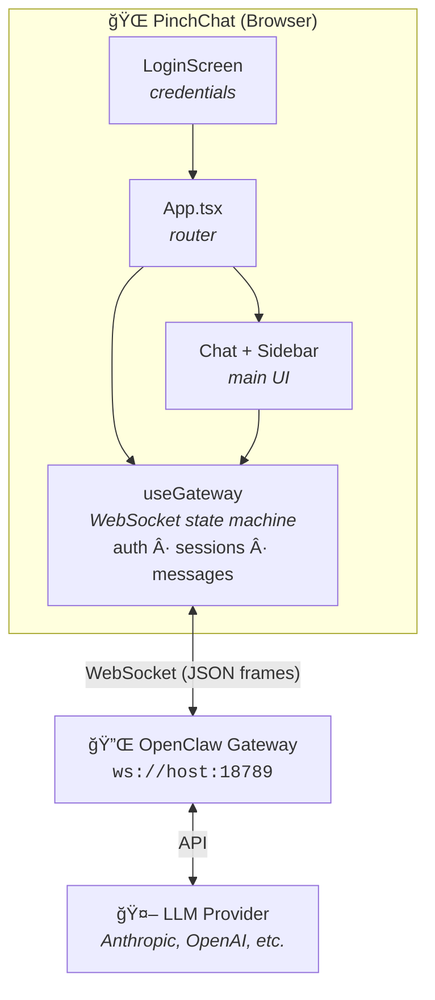

<p align="center">
  
</p>

<h1 align="center">PinchChat</h1>

[](https://github.com/MarlBurroW/pinchchat/actions/workflows/ci.yml)
[](https://github.com/MarlBurroW/pinchchat/releases)
[](https://opensource.org/licenses/MIT)
[](https://nodejs.org/)
[](https://github.com/MarlBurroW/pinchchat/pkgs/container/pinchchat)
[](https://github.com/MarlBurroW/pinchchat)
[](https://marlburrow.github.io/pinchchat/)
[](CODE_OF_CONDUCT.md)

**A sleek, dark-themed webchat UI for [OpenClaw](https://github.com/openclaw/openclaw) — monitor sessions, stream responses, and inspect tool calls in real-time.**

> 🎬 **[See the live demo →](https://marlburrow.github.io/pinchchat/)** — interactive preview of the UI with tool call visualization, streaming, and more.

<p align="center">
  
</p>

## ✨ Features

- 🔧 **Tool call visualization** — see what your agent is doing in real-time: colored badges, visible parameters, expandable results. The killer feature missing from every other chat UI.
- 💬 **GPT-like interface** — sessions in a sidebar, switch between conversations. Familiar if you've used ChatGPT or Claude.
- 📋 **Multi-session navigation** — browse all active sessions including cron jobs, sub-agents, and background tasks
- ⚡ **Live streaming** — watch the agent think and write token by token
- 📊 **Token usage tracking** — progress bars per session so you know how much context is left
- 🖼️ **Inline images** — generated or read images render directly in chat with lightbox preview
- 🎯 **Chat-focused** — no settings menus or config panels cluttering the screen. Just the conversation.
- 🎨 **Themes** — Dark, Light, and OLED Black modes with 6 accent colors. Persisted per-browser.
- 🧠 **Thinking/reasoning display** — see the agent's reasoning process in collapsible blocks with elapsed time
- 🔍 **Message search** — Ctrl+F to search and navigate through conversation history
- 📐 **Split view** — open 2 sessions side by side with a resizable divider
- ✍️ **Syntax-highlighted input** — real-time markdown coloring as you type (code blocks, bold, links)
- 🔀 **Drag & drop reorder** — organize sessions in the sidebar by dragging, order persists across reloads
- 📋 **Raw JSON viewer** — inspect full gateway message payloads for debugging
- 🗂️ **Channel icons** — Discord, Telegram, cron, and other session types shown with distinct icons
- 📤 **Export conversations** — download any session as a formatted Markdown file
- 🌐 **i18n** — English and French built-in, easy to extend

## 🚀 Quick Start

### Docker (recommended)

```bash
docker run -p 3000:80 ghcr.io/marlburrow/pinchchat:latest
```

Open `http://localhost:3000` and enter your OpenClaw gateway URL + token on the login screen.

Or use Docker Compose:

```bash
curl -O https://raw.githubusercontent.com/MarlBurroW/pinchchat/main/docker-compose.yml
docker compose up -d
```

### From source

**Prerequisites:** Node.js 18+, an OpenClaw gateway running and accessible.

```bash
git clone https://github.com/MarlBurroW/pinchchat.git
cd pinchchat
npm install
cp .env.example .env
npm run dev
```

Optionally edit `.env` to pre-fill the gateway URL:

```env
VITE_GATEWAY_WS_URL=ws://localhost:18789
VITE_LOCALE=en          # or "fr" for French UI
```

### Production build

```bash
npm run build
npx vite preview
```

Or serve the `dist/` folder with nginx, Caddy, or any static file server.

## ⚙️ Configuration

All configuration is optional — credentials are entered at runtime via the login screen.

| Variable | Description | Default |
|---|---|---|
| `VITE_GATEWAY_WS_URL` | Pre-fill the gateway URL on the login screen | `ws://<hostname>:18789` |
| `VITE_LOCALE` | UI language (`en` or `fr`) | `en` |

> **Note:** The gateway token is entered at runtime and stored in `localStorage` — it is never baked into the build.

## 🏗 Architecture



### Key Components

| File | Role |
|---|---|
| `src/hooks/useGateway.ts` | WebSocket connection, auth, message streaming, session management |
| `src/components/LoginScreen.tsx` | Runtime credential entry (stored in `localStorage`) |
| `src/components/Chat.tsx` | Message list with auto-scroll and streaming display |
| `src/components/ChatInput.tsx` | Input with file upload, paste, drag & drop, image compression |
| `src/components/ChatMessage.tsx` | Markdown rendering, tool calls, thinking blocks |
| `src/components/Sidebar.tsx` | Session list with token usage bars and activity indicators |
| `src/components/Header.tsx` | Connection status, token progress bar, logout |
| `src/lib/i18n.ts` | Lightweight i18n (English + French) |
| `src/lib/gateway.ts` | WebSocket protocol helpers and message types |

### Data Flow

1. **Login** — User enters gateway URL + token → stored in `localStorage`
2. **Connect** — `useGateway` opens a WebSocket and authenticates with the token
3. **Sessions** — Gateway pushes session list; user selects one in the sidebar
4. **Messages** — Messages stream in via WebSocket frames; the hook assembles partial chunks into complete messages
5. **Send** — User input (+ optional file attachments) is sent as a JSON frame over the WebSocket

> 📖 For a deeper dive into the codebase structure, see [ARCHITECTURE.md](ARCHITECTURE.md).

## 🌐 Adding a Language

PinchChat uses a zero-dependency i18n system. Adding a new language takes ~5 minutes:

1. **Open `src/lib/i18n.ts`** and duplicate the `en` object with your locale code:

```ts
const de: typeof en = {
  'login.title': 'PinchChat',
  'login.subtitle': 'Verbinde dich mit deinem OpenClaw-Gateway',
  // ... translate all keys
};
```

2. **Register it** in the `messages` record (same file):

```ts
const messages: Record<string, typeof en> = { en, fr, de };
```

3. **Add a label** for the language selector:

```ts
export const localeLabels: Record<string, string> = {
  en: 'EN',
  fr: 'FR',
  de: 'DE',
};
```

4. **Done.** The language selector, `VITE_LOCALE`, and browser auto-detection all pick it up automatically.

> **Tip:** TypeScript enforces that your new locale object has the same keys as `en` — missing translations won't compile.

## ⌨️ Keyboard Shortcuts

Press **?** anywhere to open the shortcuts panel.

| Shortcut | Action |
|---|---|
| `Enter` | Send message |
| `Shift + Enter` | New line |
| `Esc` | Stop generation / close sidebar |
| `Ctrl/⌘ + F` | Search messages in current session |
| `Ctrl/⌘ + K` | Focus session search |
| `Alt + ↑` / `Alt + ↓` | Switch between sessions |
| `?` | Show shortcuts help |

## ❓ Troubleshooting

### Connection fails / "WebSocket error"

- Make sure your OpenClaw gateway is running and reachable from the browser
- Check the gateway URL format: `ws://host:18789` (or `wss://` if behind TLS)
- If PinchChat is served over HTTPS, the gateway **must** also use `wss://` — browsers block mixed content
- Verify the gateway token is correct (copy-paste from your OpenClaw config)

### Blank screen after login

- Open your browser's developer console (F12) and check for errors
- Ensure the gateway is running a compatible version of OpenClaw (v0.24+)
- Try clearing `localStorage` (Application tab → Storage → Clear site data) and logging in again

### Messages don't appear / sessions empty

- The WebSocket may have disconnected silently — check the connection indicator in the header
- If the gateway was restarted, PinchChat reconnects automatically, but you may need to refresh once
- Verify the token has access to the sessions you expect

### Docker: "port already in use"

```bash
# Check what's using port 3000
lsof -i :3000
# Use a different port
docker run -p 8080:80 ghcr.io/marlburrow/pinchchat:latest
```

### Images not displaying

- Inline images require the gateway to send media as base64 data URLs or accessible HTTP URLs
- If images show as broken, the gateway may be behind a reverse proxy that strips large payloads — check proxy buffer settings

### Debugging

PinchChat includes built-in debugging tools:

**WebSocket debug logging** — open the browser console (F12) and run:

```js
localStorage.setItem('pinchchat:debug', '1');
```

Reload the page. All WebSocket frames (sent and received) will be logged to the console with a `[GW]` prefix. Set to `'0'` to disable.

**Raw JSON viewer** — click the `{ }` toggle on any message to see the full gateway payload as formatted JSON. Useful for understanding the protocol or reporting bugs.

**Metadata inspector** — hover over any message and click the ℹ️ icon to see message metadata (timestamp, ID, channel, sender info).

### Build errors from source

```bash
# Ensure Node.js 18+
node --version
# Clean install
rm -rf node_modules package-lock.json
npm install
npm run build
```

## 🛠 Tech Stack

- [React](https://react.dev/) 19
- [Vite](https://vite.dev/) 7
- [Tailwind CSS](https://tailwindcss.com/) v4
- [Radix UI](https://www.radix-ui.com/) primitives
- [highlight.js](https://highlightjs.org/) via rehype-highlight
- [Lucide React](https://lucide.dev/) icons
- [react-markdown](https://github.com/remarkjs/react-markdown) with GFM

## 📄 License

[MIT](LICENSE) © Nicolas Varrot

## 📋 Changelog

See [CHANGELOG.md](CHANGELOG.md) for a detailed history of changes.

## 🔒 Security

See [SECURITY.md](SECURITY.md) for the security policy and how to report vulnerabilities.

## 🤝 Contributing

Contributions are welcome! See [CONTRIBUTING.md](CONTRIBUTING.md) for guidelines.

## 🔗 Links

- [OpenClaw](https://github.com/openclaw/openclaw) — the AI agent platform PinchChat connects to
